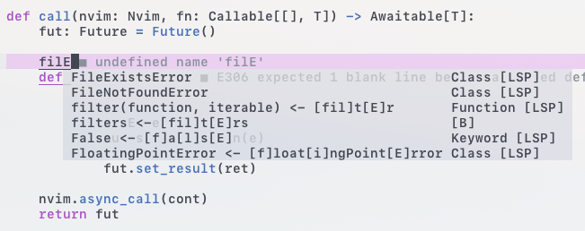

# kok.nvim - Keeper of Keyboard

Same pronunciation as [`coc.nvim`](https://github.com/neoclide/coc.nvim), but simpler and more "Vim-like".

**WORK IN PROGRESS**

## Built around Fuzzy Searching

## VScode Style Fuzzy Search

Async completion on every keystroke.

Fuzzy search through **nearby** results.



## Advanced Scheduler

- Concurrent! multi source completion

- Streaming incremental sources

- Never blocks

- Cancel culture (fetch first, cancel later)

## Install

Requires pyvim (as all python plugins do)

```sh
pip3 install pynvim
```

Install the usual way, ie. [VimPlug](https://github.com/junegunn/vim-plug), [Vundle](https://github.com/VundleVim/Vundle.vim), etc

```VimL
Plug 'ms-jpq/kok', {'branch': 'kok', 'do': ':UpdateRemotePlugins'}
```

## Documentation